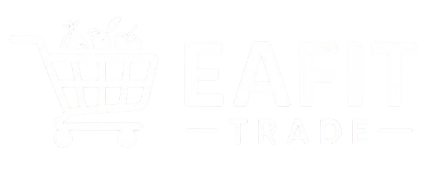

# Entregable #1 – Arquitectura MVC/MVT

## 1. Logo equipo
Inserte aquí su logo (recomendado: guárdelo en `media/Logo/` y referéncielo):

COMMUNICATE TEAM PRESENCE: cree una identidad de equipo, nombre y logo memorables.

## 2. Modelo verbal definitivo
- Objetivo: ComercIA conecta con APIs de X y Telegram para detectar palabras clave (comida, ropa, tecnología) en publicaciones y recomendar ofertas a la comunidad.
- Alcance: ingesta, categorización, visualización, administración de fuentes.
- Actores: compradores, vendedores/estudiantes, administrador.
- Beneficio: descubrimiento rápido de productos relevantes en el campus.

## 3. Diagrama de clases
Incluya aquí el diagrama del dominio (modelos de negocio). Enfoque en `Product`, `SocialSource`, `SocialPost`, `SellerProfile`, `Comment`, `Favorite`.

## 4. Diagrama de arquitectura (MVT)
Incluya el diagrama MVT mostrando cliente, servidor, vistas, templates y modelos, y el flujo de ingesta y recomendaciones.

